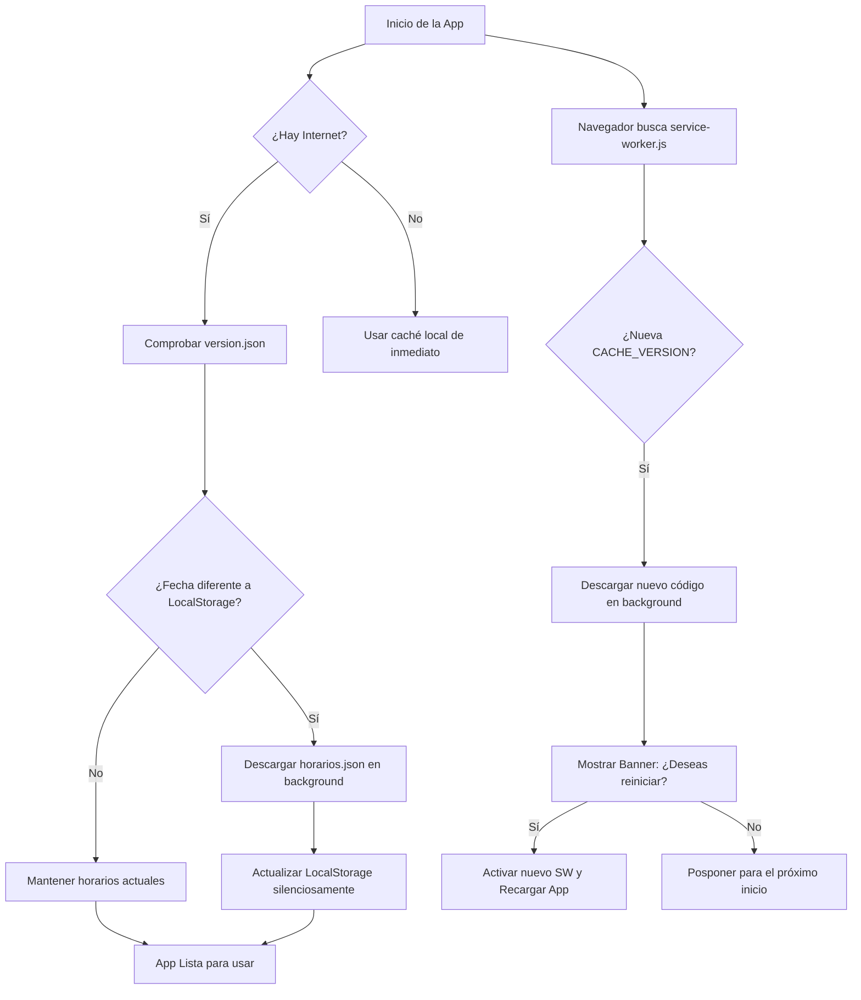

# 🚉 Biotren App - Horarios Offline

<div align="center">


**Consulta los horarios del Biotren de Concepción de forma rápida, sin conexión y con confirmación inteligente de actualizaciones.**

[📱 Instalar](#-instalación) • [🛠️ Arquitectura de Actualización](#-arquitectura-de-actualización) • [💻 Desarrollo](#-desarrollo-local)

</div>

---

## ✨ Características

### 🌟 Funcionalidades Principales
- **📍 Rutas Favoritas**: Guarda tus tramos más frecuentes para consultarlos al instante.
- **📶 Diseño Offline-First**: Acceso completo a los horarios sin conexión a internet.
- **⚡ Tiempo Real**: Consulta automática de los próximos trenes según la hora actual.
- **📅 Detección de Feriados**: Notifica si mañana o hoy es feriado en Chile (el servicio no opera).
- **🔀 Combinación Automática**: Calcula rutas complejas que requieren trasbordo en la estación Concepción (Línea 1 <-> Línea 2).

### 🎨 Experiencia PWA Premium
- Interfaz moderna en modo oscuro con bordes suaves y efectos translúcidos (*glassmorphism*).
- Altamente adaptable a pantallas móviles y tablets.
- **Safe Area Support**: Respeto total de la zona segura y el indicador de inicio en dispositivos iOS (iPhone).
- **Control de Actualizaciones**: Banner interactivo no intrusivo para decidir cuándo aplicar mejoras de código.

---

## 📱 Instalación

### Como PWA (Recomendado)

#### En iOS (iPhone / iPad)
1. Abre la aplicación en **Safari**.
2. Presiona el botón **Compartir** (⬆️).
3. Selecciona **"Añadir a pantalla de inicio"**.

#### En Android
1. Abre la aplicación en **Google Chrome**.
2. Toca el menú de tres puntos (⋮).
3. Selecciona **"Instalar aplicación"** o **"Añadir a pantalla de inicio"**.

---

## 🔄 Arquitectura de Actualización

Para optimizar el rendimiento y ahorrar datos móviles, la aplicación separa de manera estricta la actualización de **datos** (horarios) de la actualización de **código** (diseño/funcionalidades).



### 1. Actualización de Horarios (Datos)
* **Archivos involucrados:** `version.json` (50 B) y `horarios.json` (3.4 MB).
* **Frecuencia:** Cada vez que el scraper semanal en GitHub Actions detecta cambios y realiza un despliegue.
* **Flujo:** `app.js` descarga `version.json` en segundo plano, compara la fecha con la local, y si hay cambios, descarga `horarios.json` actualizando el `LocalStorage` **silenciosamente sin necesidad de reiniciar la app**.

### 2. Actualización de la App (Código)
* **Archivos involucrados:** `index.html`, `style.css`, `app.js`, `service-worker.js`, etc.
* **Frecuencia:** Solo cuando se modifica el código fuente de la aplicación.
* **Flujo:** El navegador detecta una nueva versión de `service-worker.js` (cambio en `CACHE_VERSION`). Al finalizar la descarga de los nuevos archivos en segundo plano, se muestra un banner consultando al usuario: **"Hay una nueva versión disponible. ¿Deseas reiniciar ahora?"**.
  * **Sí, reiniciar:** Aplica los cambios inmediatamente recargando la página.
  * **Más tarde:** Oculta el banner y los aplica de forma transparente la próxima vez que se abra la app.

---

## 💻 Desarrollo Local

Para realizar pruebas locales de la PWA y su Service Worker, clona el proyecto y levanta un servidor HTTP local (los Service Workers requieren HTTPS o `localhost`/`127.0.0.1` para registrarse):

```bash
# Servir usando python
python -m http.server 8080

# O usando Node.js (http-server)
npx http-server -p 8080
```

### Forzar simulación de actualización PWA
1. Modifica algún estilo en `style.css` o añade un cambio en `index.html`.
2. Incrementa la constante `CACHE_VERSION` en [service-worker.js](file:///c:/Users/night-ghost/Desktop/awds/app-efe-main/service-worker.js) (ej. de `"biotren-v3.4.6"` a `"biotren-v3.4.7"`).
3. Recarga la página en tu navegador y verás aparecer el banner de actualización.

---

## 📂 Estructura del Proyecto

* **[index.html](file:///c:/Users/night-ghost/Desktop/awds/app-efe-main/index.html)**: Estructura de la aplicación, CSS crítico inline y lógica de registro del Service Worker.
* **[style.css](file:///c:/Users/night-ghost/Desktop/awds/app-efe-main/style.css)**: Estilos responsivos de la interfaz y transiciones del banner de actualización.
* **[app.js](file:///c:/Users/night-ghost/Desktop/awds/app-efe-main/app.js)**: Lógica de negocio (búsqueda de horarios, combinaciones, favoritos y sincronización de datos).
* **[service-worker.js](file:///c:/Users/night-ghost/Desktop/awds/app-efe-main/service-worker.js)**: Estrategias de almacenamiento en caché offline (`stale-while-revalidate` y `network-first`).
* **[estaciones.js](file:///c:/Users/night-ghost/Desktop/awds/app-efe-main/estaciones.js)**: Listado de estaciones y líneas del Biotren.
* **[manifest.json](file:///c:/Users/night-ghost/Desktop/awds/app-efe-main/manifest.json)**: Configuración de la PWA para su instalación en dispositivos móviles.
